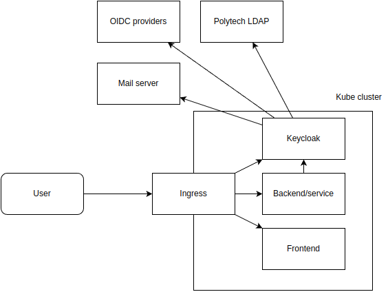
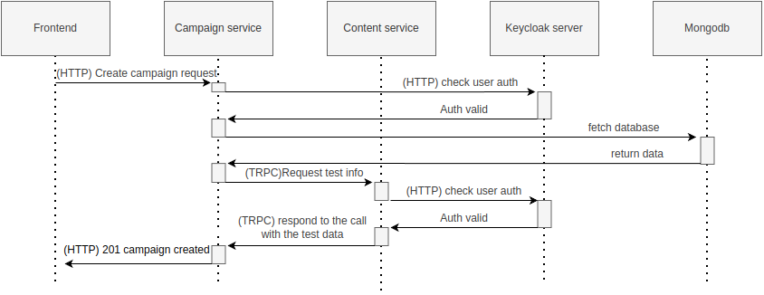
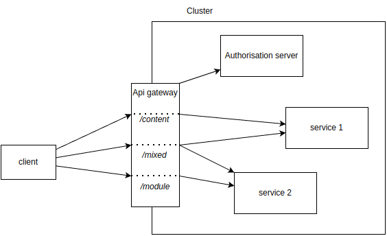

=  Polycode
Nils Ponsard <nils.ponsard@etu.umontpellier.fr>
20-01-2023
:doctype: book
:reproducible:
:toc:


== 1 Functional quarter
=== Vocabulary 

* Admin : A privileged user that has CRUD access to all the data.
* User : Person that has a PolyCode account.
* Candidate : Person that participate to a test.
* Guest : Person that doesn't have a PolyCode account.
* Captain : Person that owns and manages a team.
* Assessment Creator : Person that can create assessments and manage them.
* Practice Creator : Person that can create contents, modules and manage them.
* Test : Ordered list of questions meant to evaluate a candidate.
* Campaign : Association of a group of candidate and a test.
* Question : Content that is used in a test.
* Module : A group of contents and other modules.
* Content : Coherent group of components that are organized in a tree structure.
* Component : Display element or interactive element in a content (example : code challenge, markdown information text).
* Hint : A piece of information that the user can buy to help him solve a problem (in a code challenge).
* PolyPoints : Virtual currency used to buy hints, earned by completing all submittable of contents and modules.
* Runner : Sandboxed environment that runs the code of the candidate.
* Submittable : Component that exposes a problem to solve. The user can submit a submission to solve the problem.
* Submission : User's answer to a submittable, validated through a validator.
* Team : Group of users, teams are ranked in a leaderboard based of the total score of their members.
* Validator : Instructions to test the validity of a submission (example : for a specific input expect a specific output).
* Tag : Keyword that can be associated to a content or a module.


<<< 
=== User stories

==== User management 

[cols="1,1,1"]
|===
|As a |I want to |So that

|Guest
|Create an account
|Use the features of the app

|User
|Update my emails
|Update my ways to recover my account, get important updates and notifications

|User
|Receive a welcome email after creating an account
|Know that my account has been created

|User
|Get information about my account
|Review my account information

|User
|Get info about another user 
|Know the user

|User
|Update my username, programming languages and short description
|Keep my information up to date

|User
|Delete my account
|Remove my data from the app

|Admin
|Promote a user to Content Creator
|Give the right to create content to a user

|Admin
|Promote a user to Assessment Creator
|Give the right to create test to a user

|Admin
|Promote a user to Admin
|Give the right to manage the app to a user

|Admin
|Create a new user
|Add a user to the app

|Admin
|Get all the information about a user
|Facilitate moderation

|Admin
|Update the information of a user
|Facilitate moderation

|Admin
|Delete a user
|Facilitate moderation

|===

==== Authorization 

[cols="1,1,1"]
|===
|As a |I want to |So that

|User
|Log in to my account via email and password
|Access my account

|User
|Logout of my account
|Prevent unauthorized access to my account

|User 
|Reset my password
|Get access to my account if I forgot my password


|===

==== Teams 

[cols="1,1,1"]
|===
|As a |I want to |So that

|User
|Create a team 
|Participate to the team leaderboard an gather users

|Captain
|Invite users to my team
|Add users to my team

|Captain
|Kick users from my team
|Remove users from my team (inactive, problematic, etc.)

|Captain
|Give the captain role to another user
|Transfer the captain role to another user

|Captain
|Delete my team
|Remove my team from the app

|Captain
|Update info about my team
|Keep my team info up to date

|User
|Accept an invitation to a team
|Join a team

|User
|Leave a team
|cease to be associated to a team

|User
|Get info about a team, members, points, name, description
|Know the team

|User
|Get the leaderboard of teams
|Know the ranking of teams

|User
|Get the leaderboard of users in a team
|Know the ranking of users in a team

|Admin
|Get, create, edit, delete a team

|===

==== Content management

[cols="1,1,1"]
|===
|As a |I want to |So that

|User 
|Get the list of available content
|Know the content available

|User
|Get the list of available modules
|Know the modules available

|User
|Get the list of contents and submodules of a module
|Know how to complete a module

|User
|Get the latest modules and contents
|Know what have been added recently

|User
|Get the information about a content
|Know the content

|User
|Get the information about a module
|Know the module, the objectives 

|User
|Get the information about a test
|Know the test, its objectives

|User
|Get the components of a content
|Get the information the content aims to convey, it's submittable

|Content Creator
|Create a content, (markdown, code challenge components)
|Teach a notion

|Content Creator
|Create a module
|Organize the contents 

|Content Creator
|Add contents to a module
|Organize the contents

|Content Creator
|Add submodules to a module
|Organize the modules hierarchy

|Content Creator
|Edit the name, description, tags, rewards, inner components of a content I created
|Keep my content up to date

|Content Creator
|Edit the name, description, tags, rewards, inner contents and submodules of a module I created
|Keep my module up to date

|Content Creator
|Delete a content I created
|Remove my content from the app

|Content Creator
|Delete a module I created
|Remove my module from the app

|Admin
|Get, create, edit, delete a content
|Content moderation

|Admin
|Get, create, edit, delete a module
|Content moderation

|===

==== Submissions

[cols="1,1,1"]
|===
|As a |I want to |So that

|User
|Submit a solution to a submittable component
|Validate my solution

|User
|Execute a validator on my code
|Validate my solution on a public validator

|User
|Get the last solution I submitted to a submittable component
|Get back to my solution and improve it

|User
|Write a solution to a submittable component in a code editor (for a code challenge)
|Write my solution and test it

|User
|Add new sources files to a code editor (for a code challenge)
|Split the code answer in multiple files

|User
|Delete a source file from a code editor (for a code challenge)
|Organize the code answer in multiple files

|User
|Buy a hint for a submittable component
|Get a piece of information to help me solve the problem

|User
|Get my progress on a module
|Know how much I have completed a module

|User
|Get the global user leaderboard
|Gammification 

|===

==== Test management

[cols="1,1,1"]
|===
|As a |I want to |So that

|Assessment Creator 
|Create a test
|Evaluate a candidate

|Assessment Creator
|Edit the name, description, tags, rewards, inner contents of a test I created
|Keep my test up to date

|Assessment Creator
|Delete a test I created
|Remove my test from the app

|Admin
|Get, create, edit, delete a test
|Content moderation

|Assessment Creator
|Create a test campaign
|Evaluate candidates

|Assessment Creator
|Add candidates to a test campaign via the web interface
|Evaluate candidates

|Assessment Creator
|Get the list of candidates in a test campaign
|Evaluate candidates

|Assessment Creator
|Remove candidates from a test campaign
|Evaluate candidates

|Assessment Creator
|Add candidates to a test campaign via a CSV file
|Evaluate candidates

|Assessment Creator
|Add candidates to a test campaign via an api access
|Automate candidate addition

|Assessment Creator
|Remove candidates from a test campaign via an api access
|Automate candidates deletion

|Assessment Creator
|Review the submissions and scores of candidates on a test
|Evaluate the candidates

|Assessment Creator
|Add tags to a candidate
|Organize the candidates

|Assessment Creator
|Set a completion deadline for a test campaign
|Limit the time a candidate has to complete the test

|Assessment Creator
|Define a time limit for each questions in a test
|Limit the time a candidate has to answer a question

|Assessment Creator
|Define the number of points granted for each question in a test
|Giving weight to each question

|Candidate 
|Get back to a test I started and continue it if the time limit is not reached
|Complete the test

|Candidate
|Receive a mail with links to accept or refuse a test 
|Accept or refuse a test

|Candidate
|Participate to a test using the link provided in the mail
|Complete the test

|Assessment Creator
|Edit the test, the questions, the time limit and the points granted for each question
|Keep the test up to date

|Assessment Creator
|Set a start date for a test campaign
|Schedule the test

|Assessment Creator
|Resend the invitation to a candidate
|Make sure the candidate received the invitation

|Candidate
|Receive a mail with the results of a test
|Know the results of a test

|Assessment Creator
|Compare the candidates results
| 

|Assessment Creator
|Visualize the candidates results on a graph or a table
|Get a graphical representation of the results

|Assessment Creator
|Export the results of a test campaign
|

|Assessment Creator
|Order the candidates by their results and tags
|Organize the candidates

|Assessment Creator
|Download the raw data of the candidates results
|Be able to do statistical analysis on the results


|===


Architecture : `sketches/Q1-microservice/architecture.drawio`

image::sketches/Q1-microservice/architecture.png[]


== 2 Identification and OIDC

A very critical part of an application is the authentication of the user. Handling the authentication in our backend adds many security concerns to take care of. In addition we will need to rewrite the authentication part to create an authentication service that all the microservices can use. On top of that the addition of new authentication methods will require a lot of work.

Adding third party authentication services like Google, Facebook, Github, etc. allows the user to use one of their existing account to authenticate, removing the need to remember another password and worry about the security of the password storage in the application server.

OpenID Connect (OIDC) is a protocol that allows a user to authenticate to a third party authentication service and get an access token that can be used to authenticate to a resource server. The resource server can then verify the token and get the user information from the authentication service.

Keycloak is an open source OIDC provider that can be used to authenticate users to our application. It itself supports many third party OIDC services like Google, Github, etc. It also supports connecting to an LDAP server to authenticate users.

=== Proof of concept

To illustrate the use of Keycloak I created a proof of concept that replaces the current authentication system with Keycloak. 

The proof of concept code is available through the following repositories :

`git@github.com:nponsard/polycode-frontend-keycloak.git`

`git@github.com:nponsard/polycode-backend-keycloak.git`

A deployment has been made available here : https://polycode-key.juno.nponsard.net[https://polycode-key.juno.nponsard.net]

=== Authenticating users using Keycloak

A client first need to be created in Keycloak. To separate from the main Keycloak configuration, the `polycode` client has been created in a realm named `polycode`. In the realm settings, we need to enable registration, and add the different OIDC and LDAP providers we want to use. As the identifier of an user is a verified email address, the "trusted email" option of the third party providers needs to be enabled.

To authenticate the user user using Keycloak the application needs to implement the OIDC protocol.

First, when the user wants to authenticate, the frontend generates a PKCE code verifier, stores it in the local storage of the browser generates a PKCE code challenge then redirects the user to the Keycloak login page with the PKCE code challenge and a application id. The PKCE is used to verify that the user is redirected back to the application and not to a malicious application. 

The user then creates an account on Keycloak, uses an existing account, uses a third party OIDC service to authenticate or connects on a LDAP service.

After the user has authenticated keycloak redirects the user back to the frontend with a one time code in the url. The redirection url is set in the Keycloak client configuration.

The frontend then uses the code and the corresponding PKCE code verifier to and one time code get an access token from Keycloak. The access token retrieved is then stored in the browser local storage to be used for future requests.

The frontend uses this access token to get basic user information (username on the app, points) to the backend. The backend first checks the validity of the token by calling the Keycloak userinfo endpoint. If the token is invalid, the backend returns an error to the frontend. Otherwise the backend then checks if the email of the user is verified. If the email is not verified, the backend returns an error to the frontend. If the email is verified the backend checks if an user exists with the same email. If no user is found a message is sent to the frontend to ask the user to create an account. If an user is found the backend returns the user information to the frontend.

Every error returned by the backend is explained to the user in the frontend.

If the user is not found by the backend, the frontend prompts the user to choose an username (the field is filled with the username that Keycloak passed in the access token) and accept the terms of service. The frontend sends the username with the token to the backend. The backend then creates a new user with the username and the email of the user. After that the user is authenticated and can use the application.

<<<
=== Sequence diagrams

Following are the sequence diagrams illustrating the different authentication flows discussed before.

==== Google login


<<<
==== Google register


<<<
==== LDAP login

image::sketches/Q2-identification/ldap-login.png[]

<<<
==== LDAP register

image::sketches/Q2-identification/ldap-register.png[]

<<<
==== Vanilla login


<<<
==== Vanilla register

image::sketches/Q2-identification/vanilla-register.png[]

<<<
=== Deployment

Every service will access the Keycloak server to check the validity of the token and get the user information if needed. The Keycloak server will be deployed in a separate pod and will be accessible to the backend services and to the users via an ingress controller or proxy. The Keycloak server will be deployed in a separate pod in the cluster.



As every service will need to access the Keycloak server for authentication the architecture should look like this :

image::sketches/Q2-identification/architecture.png[]

=== Authorization

The Keycloak server can be used to manage the authorization of the users. We could also delegate the roles management to keycloak. So every service would do a request to Keycloak to check if the user has the right to access the resource. This has not been implemented in the proof of concept as it requires way more modification to move the authorization system. It could be done in the next iteration with enough time and resources.

== 3 Microservice communication

---- Every internet facing services will be behind a proxy/ingress with load balancing and high availability

Some microservices depends on other microservices to get data, to do so they need a way to communicate with each other. This include having a protocol and a way to access the other services.

=== Proof Of Concept

A proof of concept has been made to illustrate the idea :

Accessible here : https://trpc.juno.nponsard.net/[trpc.juno.nponsard.net]

This proof of concept is an api tha returns three words to generate a random phrase, one adjective, one noun and one verb. The api is composed of three services :

* The adjective service : has a function that returns a random adjective.
* The word service : has a function that returns a random noun or a random verb depending on the parameter.
* The 'web' service : on a GET request, calls the adjective service to get a random adjective, then calls the word service twice, once to get a random noun and once to get a random verb. The three words are then returned in a json object.

=== Environment variables

To point to the other services, we can use environment variables. Each services will require environment variables to be set to point to the other services it depends on.

This can easily be set to point to a dns name, a load balancer or a service name in kubernetes, enabling high availability and load balancing.

In the POC the environment variables are set to point to the name of the docker-compose service with the ports also configured.

```
- ADJECTIVE_SERVICE=http://adjective:3000
- WORD_SERVICE=http://word:3000
```

This can become tedious to setup, these variables could have a default value corresponding to the usual service name of the deployment.

=== Protocol 

There are many protocols for communication between services, unix sockets and IPC don't match our requirements as the two services would need to be on the same machine but we want to have distributed services that can be deployed on different machines for high availability and load balancing.

Communicating over the network seems to be the best option, but there are many protocols to choose from. We could communicate over TCP or UDP, but we would need to manually do a lot of the work that is already done by HTTP (serialization, deserialization, error handling, binding and listening on a port, identifying route/functions ...). Using HTTP would be a viable option but it would require to implement the server and the client side of the communication, openapi/swagger tools could help to generate those but it's still a lot of code to maintain.

Remote Procedure Call protocols can solve a lot of the issues reported above, it works over the network and HTTP, it has a lot of tools to generate the client and server side of the communication, it has a lot of features like type checking, code completion, error handling...

TRPC is a remote procedure call library for TypeScript, it enables remote procedure calls with type checking, and typescript code completion. Calls are made over the HTTP protocol so it can even be routed through layer 7 proxies/load balancers.

With TRPC the api is defined on the server via typescript types and the client uses the same types to get linting and type checking when calling the api. This makes the communication between the services very easy to write and maintain.

The syntax is very easy to use : 

[source,typescript]
----
wordService.randomWord.query('verb')
----

Parameters are passed as parameters to the query function and a promise with the body of the response is returned.

There is a few drawbacks, the client and the server needs to have access to the typescript type definitions, this can be mitigated by using one repository to store the sources of all the services. The other drawback is that TRPC is made to work only with typescript projects so it would rule out the possibility of using other languages for some services.

If we want to use other languages, we could use gRPC, it's a remote procedure call protocol that works over HTTP/2 that is based on protocol definition files instead of typescript types.

=== Example flow

see `sketches/Q3-communication/sequence.drawio`



== 4 Traceability and logging

Traceability and logging is a very important part of a microservice architecture. It enables to debug issues, to monitor the health of the services and to get statistics on the usage of the services. Logging to the console isn't enough, we need to be able to aggregate logs, visualize the execution flow of the services.

Also since a request can solicit multiple services, we need a way to know what request produced a log, to be able to trace the execution flow of a request.

One way would be to engineer a custom solution, services add a request id to the logs and to the requests they make and report the logs to a central logging service. The central logging service would aggregate the logs and form traces from the request ids. This would be a lot of work to implement and maintain. There are already existing solutions that can do this like OpenTelemetry.

=== OpenTelemetry

OpenTelemetry has instrumentations that export logs and statistics to a collector. The collector can then export data to be visualized in a dashboard like prometheus/grafana or jaeger.

We need to add the instrumentation to the services code and deploy a collector, set the instrumentations to export to the collector and then set the dashboard to get data from the collector.

OpenTelemetry has a tracing feature that enables to trace the execution flow of a request across the services. It can be used to visualize the execution flow of a request and to get statistics on the execution time of the services.

deployment : `sketches/Q4-tracing/deployment.drawio`

image::sketches/Q4-tracing/deployment.png[]

Here you can see every service we programmed has a instrumentation that reports logs and statistics to a collector. The collector is deployed in a kubernetes cluster, here it is set to export to prometheus and jaeger.

== 5 Search engine

As there will be a lot of content on the platform, a way to search for modules, practices will be needed. The user need to easily find the content he is looking for, the search option need to find matches in the title, description, content and tags of the modules and practices.

=== UI

You will find here sketches for the different pages of the desktop interface concerning the search of content.

The search bar will reside centered in the top bar of the interface, visible on almost every page.

When the user starts to type into the search field suggestions will be shown in a dropdown menu. Clicking on a suggestion will fill the search field and validate the search.

The use input will be validated when the user presses enter or clicks on the search button.

Once the search is validated, the results will be shown in a list, the results will be ordered by relevance. All types will be mixed in the same list, the type will be shown on the card of each result.


Source file : `./sketches/Q5-search/ui.drawio`.

image::sketches/Q5-search/ui.png[]

=== Obtaining search results

Once the search is validated, we can use the search function of mongo to get results and order them by relevance using weights.

This technique is easy to add as mongodb is already used to store the contents, modules and assignments.

One problem is that this adds more load to the database, adding nodes to the mongodb cluster could help with performance problems by distributing the load.

To order the results by relevance we can use the text index of mongodb, it can be used to search for text in multiple fields and give a score to the results. I would weight the matches in the fields like this :

* 1 for matching in the description
* 2 for matching in the title
* 3 for matching in the tags

With this weighting, the tags will have the most impact on the score, then the title and finally the description. Tags categorizes the most all contents, the title is the most important part of the content and the description is the least important and can talk about other contents, so it should have the least impact on the score.

Results ordered by points, then by date of creation (a button can be added in the UI to change the ordering to date then points).

=== Implementation

There is no new deployment needed, just a new index on the mongodb database and a new endpoint on the content service.

We can create an index with this command on the mongo shell :

[source,JavaScript]
----
db.content.createIndex(
   {
     description: "text",
     tags: "text",
     title: "text"
   },
   {
     weights: {
      description: 10,
      title: 20,
      tags: 30
     },
     name: "TextIndex"
   }
 )
----

To search for a text we can use this command :

[source,JavaScript]
----
db.content.find(
   { $text: { $search: "rust in 30 days" } },
   { score: { $meta: "textScore" } }
).sort( { score: { $meta: "textScore" } } )
----

The sequence diagrams are simple since we offload all the work to MongoDB.

See `./sketches/Q5-search/search-sequence.drawio`.


Another option would be to use a search engine like elastic search, it would be more flexible but would require to add a new service and add complexity to the storage of the content.

=== search suggestion

Search suggestion is a purely optional feature, it can be added later if there is time. It would be a nice to have feature to improve the user experience.

To do that we could use a collection storing the search history of all users, containing the search query and the number of times it has been searched. The text index will be on the query field. We would use the text search feature of mongodb to match the beginning of the query.

When a user starts to type in the search field, the server will respond with suggestion of queries, matched by the beginning of the text, ordered by the number of times researched.

When a search is validated by the user, the query is added to the search history collection, if it already exists, the number of times it has been searched is incremented. To limit the number of duplicates, the query string would be lowercased and trimmed before searching and being added to the collection.

Schema : 

[source,JavaScript]
----
{
  query: string,
  count: number
}
----


== 6 Runner architecture

As one of the main feature of the application is to write code to solve a challenge, we need a way to safely run the code submitted by the user and check the output of the code to validate the solution. For that Polycode uses a runner system.

=== Runner definition

A runner is a service used to run code sent by the user in a sandboxed environment. It feeds data to the standard input (stdin) of the programs and returns the standard output (stdout) and standard error output (stderr) of the program to agent for validation.

Validity of the solution can be checked by sending specific inputs to stdin and checking if the output corresponds to the expected output.

=== Execution isolation 

To negate the effect of malicious code, the user submitted code should not have arbitrary file system and memory access, internet access, host system access. The running program should also be limited in CPU and memory usage to prevent denial of service attacks.

Internet access of machine running the code could be entirely disabled, this may limit the possibilities for some network related exercises, this also means all libraries needed for the exercises should be included in the image. On the other side, blocking internet access would limit a lot the possibilities for a malicious user to exploit the runner system.

=== Using a virtual machine

Virtual machines are a way to better isolate the running process but requirers more resources as a kernel is created for each program run. Start times may be slower as the kernel need to boot first before executing user code.

There would be a runner manager that manages the virtual machine and communicates to a runner agent that is inside the virtual machine and manages the execution of the code.

Each supported language would have its own initramfs image with the bare minimum to make code work. This makes the image smaller and faster to load in ram. In this image an agent program would be running to communicate with the runner manager to retrieve the code to run, setup the environment, run the code and return its output.

The communication between the manager and the agent can be done multiple ways. The easier would be to have a network interface setup in the VM to communicate using HTTP request, the agent providing a simple HTTP api that the manager can call to control the execution of the code. Another option would be to use a serial interface to communicate, this option consumes less resources but is less convenient. This will likely be the option for the project virt-do/lambdo as the support for a network interface is not yet implemented.

=== Runner registration 

We could add an api endpoint and an interface element in the administration interface of polycode to generate a runner token. This runner token will be then passed to a runner manager that uses this token to authenticate and register to the runner api. Every minutes the runner manager does a request to the runner api to get code to run. The api returns some user code needed to be run the runner manager then runs the code and sends the result to the runner api.

New runners could be added by the server administrator and an option to scale the number of runners automatically by adding more runners when the job queue is too long or in when a high usage of the platform is expected would be useful. To scale down the runner api would return zero code to execute to the runner manager then send a special response to the runner manager to indicate to stop, or if the runners are in a kubernetes cluster the api would schedule the pods for deletion. the runner manager would finish its current job queue then stop.

If the runner service doesn't get a return value for a job after a certain amount of time, around a minute, an error is thrown and the user is notified. The user is then expected to re-send a request to run the code.

The runner manager could also send to the runner api the resources available on the machine so the runner api can adjust the number of jobs to schedule to this instance depending on the expected execution time.

== 7 Data architecture

=== Current data architecture

Currently the data is stored in a postgresql database for the data structures that are relational and with a static structure. The contents of the courses and practice are stored in a mongodb database.


<<<
=== New data architecture

With the points talked before the data architecture wouldn't change much. For authentication keycloak uses a postgresql database to store the necessary information, these information could be stored on the same postgresql server as the data application. If performance becomes a concern we could move the keycloak database to a separate server. On the mongodb side, the only addition is the search history collection and the text search index on the contents and modules.


== 8 Mobile app

Most of our target audience has a smartphone, creating a mobile app would allow to extend the functionalities of the platform.

=== Functionalities

When designing functionalities for a mobile app we need to keep in mind the constraints of the platform, typing on a small screen is not as easy as on a computer, the smaller screen makes it hard to display a lot of information at once, also the user may not always have internet access.

==== Content consumption (courses, practice)

As the main goal of the app is to teach new knowledge, reading courses and practice content should be the core functionality of the app.

The user should be able to browse the content available, practice/course and modules. The user should also be able to see the contents and submodules of a module.

As the user may go offline, downloading content and modules for offline use would be a useful feature. The download button would be shown on the card view of a content or module (see the sketch). For a module, clicking the download button downloads all the contents of the module and recursively downloads the submodules. Downloading a content means getting the content object from the server, containing all the components (markdown, code editor, MCQ) and reading the markdown text to download the embedded resources (images, videos).

The user should be able to manage the downloaded content in a separate page of the application, showing the downloaded content and modules. The user should be able to delete the downloaded content from the app (the download button on the card is replaced by a delete button).

==== Interacting with the content (MCQ, code challenge)

User interaction is difficult to handle on mobile. The screen form factor and the lack of keyboard makes it hard to type code while reading the instructions or the code. This is why we should not support the code challenges on mobile, or at least not for the first iteration of the app, it could be an option in the settings to enable the code challenges anyway if the user is willing to do it.

Answering MCQ questions is easier, the user can select the answer and submit it. If the user is offline, the answer will be saved and sent to the server when the app gets internet access again. When the submitted answer has ben verified by the server, it is displayed in the content. An option to add would be to send a notification when the application receives the verification from the server, so the user can jump back to the content and see the result.

==== Notifications

Notifications are a good way to keep the user engaged with the app. The user should be notified when a new content is available in a module he is following (where he started a content in it). A good option to have would be to opt in to receive notifications when a new content is published and another option to receive a notification when a new module is published.

To receive notifications, the app would send a request to the api to inform what notifications the user has subscribed to. The api returns a identifier for the phone.

To get new notifications, the app would send a request to the api with the identifier and the id of the last notification received, the api would return the notifications that have been published since the last notification received. 

==== Account management

The user should be able to manage his account from the app : change his password, his emails, his preferred language, his username and bio.

The user should also be able to view the teams he is part of and their points. Team isn't a core feature of the platform so I think the first version of the app should not support advanced team management. 

I think it should be feasible tho to add team management in a later version, with the ability to create a team, invite users, manage the team members, view the leaderboard in the team and of the teams.

<<<
=== UI sketch

This is how I think the layout of the app should be. All the elements should follow the material design guidelines and the design choices of the website.

There is a bottom navigation bar with 4 tabs : home, search, downloads, account. The home tab is the default tab when the app is opened. The search tab is used to search for content and modules. The downloads tab is used to manage the downloaded content. The account tab is used to manage the user account.

see `./sketches/Q8-mobile/pages.drawio`

image::sketches/Q8-mobile/pages.png[]

<<<
=== Authentication

Assuming a keycloak authentication service is already set up, we can use the oauth2 protocol to authenticate the user so they can use the same account on the web app and the mobile app.

To authenticate to keycloak using oath2, the app would generate a PKCE code verifier and a code challenge before opening a web browser with a request to keycloak. The user would authenticate with his account on keycloak and the web browser would redirect to the app with an authorization code. The app would then send a request to keycloak with this authorization code and the code verifier to get an access token and a refresh token. The access token is used to authenticate the user to the api and the refresh token is used to get a new access token when the current one expires.


== 9 Microservice security

To secure the application we need to secure every part of it.

The first thing we can do and is already done is enable HTTPS between the user and the point of ingress of our cluster, this encrypts the communications and prevents most of the Man in the Middle attacks. 

We also need to apply the principle of least privilege, giving access to the minimum amount of access to the user, to the services, to the developers.

To secure communication between microservices we can set up different certificates for each services, use them to encrypt the communications and make the services check the certificate of the services it's using.

The sensitive configuration options should be stored in a secret or in a secrets management solution like vault and mounted as environment variables in the pods. These secrets include tokens to access certain services, database credentials, encryption keys for JWT tokens, certificates for service authentication.

Istio offers a solution by encrypting the communication between services and by providing a certificate authority that can be used to sign certificates for the services. Everything is easily configurable using kubernetes deployments.

A sample istio configuration has been deployed at : https://istio-demo.juno.nponsard.net/productpage.

There are multiple reviews services and a details service used by the product page service that is then exposed by a istio ingress gateway. The communication between the services is encrypted using TLS and the ingress gateway is using a certificate signed by a certificate authority that is trusted by the browser.  

== 10 Integrate microservices in the frontend

With our backend logic split into multiple microservices, the frontend needs to communicate with all of them. With all the services running in a cluster, all the services need to be accessible from one unique public IP address and port. This can be done using multiple techniques.

=== HTTP Proxy

An HTTP proxy can route requests depending on the headers of the request. We could differentiate which service to redirect to depending on the domain name that has been requested. We can register a wildcard (*) record that points to the cluster so every subdomain is pointing to the cluster. Then we can route using the proxy (for example nginx), this solution can be easy to work with in a production environment as each service will be clearly identifiable by its subdomain. For a development environment this solution causes some issues as it would require to setup a dns server on the local machine to resolve the subdomains or to add custom code to the frontend to use different ports instead of subdomains.

Instead of subdomains we could route the requests using the path present in the request. For example every request to `http://api.polycode.do-2021.fr/content` would be redirected to the content service. This solution is easier to work with in a development environment as it doesn't require to setup a dns server or to write custom frontend code. This could cause problems if two services expect to receive requests on the same path, only one of them would receive the request. This is easy to find and fix as the request would fail directly in a development environment.


=== Api gateway

An api gateway is a service that provides an internet-facing api to access the functions of the application. The api request applies some logic to the request, it can aggregate data to return the responses of multiple services in one response, it can handle authorization, logging and monitoring.

When a request is made to the api gateway, the gateway will check the authentication of the user, if the user is not authenticated, the gateway will return a 401 response. If the user is authenticated, the gateway will check the authorization of the user, if the user is not authorized, the gateway will return a 403 response. After all passing all the authorization verification, the gateway will send a request to one or more services to get the data needed to return the response, then the gateway builds a response fom the responses of the services and returns it to the user.

Failover can be handled here by returning default data or an error code if one of the requests to the services fails.

Also man in the middle attacks between the api gateway and the internal services could be dangerous as the internal services trust the api gateway. If the attacker manages to spoof the api gateway, the attacker could send requests to the internal services with the authorization of the api gateway.



=== Comparison

The difference of the proxy with the api gateway is that the proxy doesn't have any logic, it just forwards the requests to the services. The api gateway can have some logic, for example it can check the authentication of the user before forwarding the request to the service and build responses with the response of multiple services.

Using a proxy each service would have to have an HTTP api, handle the correct authorization and authentication of the user, handle the errors and return the correct response. 

Using an api gateway each service would only have to handle the logic of the service, the api gateway would handle the authorization and authentication of the user, the errors and the responses. This would require to maintain a service that interacts with all the services so an added functionality in a service would require to update the api gateway. 

As polycode already has a working monolithic backend that handles the authorization and authentication of the user, we can use thi backend as our api gateway, this allows us to gradually switch to a microservice architecture without having to rewrite the authorization and authentication logic, if a function is still in the monolithic backend the monolithic does all the work, if some of the logic is moved to a microservice the monolithic backend will forward the request to the microservice and return the response.

=== Effect on user experience

Proof of concept : `git@gitlab.polytech.umontpellier.fr:nils.ponsard/microservice-ui.git`

The proof of concept is available at https://polycode-ui.juno.nponsard.net/ (username : `admin@gmail.com`, password : `12345678`), tab assessment.

In this proof of concept I made a simple assessment service that returns a question and has an endpoint to check the answer. The page interacting with the service is a simple Next.js page that fetches the question from the main backend service, that forwards the request to the assessment service. The user can then choose an answer that is then checked by the assessment service (also forwarded by the main backend).


The user stays on the domain name, the page is served by the same fronted server and the api requests are still made to one unique front facing service. The only difference is that the requests are forwarded to the microservice. 

The user won't notice any difference except for the latency than can increase a bit but will stay acceptable (adds only a few milliseconds). The component style stays the same, the authentication is still handled by the main backend so the user doesn't have to log in another time. The user has no way to know that the page is handled by a microservice (same domain, same website).

== Bonus : Microfrontends

When multiple teams are working on the same project, it can be helpful to split the project into individual components that can be worked on independently. In a backend context this is called microservices, in a frontend context this is called microfrontends.

Microfrontends can be achieved using web components, a web standard supported by all modern browsers. Web components are a set of web platform APIs that allow you to create new custom, reusable, encapsulated HTML tags to use in web pages and web apps.

This allows to split the frontend into multiple components that can be worked on independently. Each component can be developed using different frameworks.

To look seamless, the components need to follow the same design rules, a global style sheet can be used to define all the styles. Another option is to use the same library everywhere, for example material-ui. 

=== Webpack module federation

Webpack has a feature called module federation that allows to import other webpack modules from a webpack application. These modules can export React components that can be then used in the application. These modules can be imported from a remote server, this allows to change the code of the module without needing to rebuild the entire application.
Module federation also allows to share dependencies between the application and the module, this allows to use the same version of a library in the application and in the module and avoid having multiple react instances in the application.

Props can be passed to the component, this allows to pass the configuration of the component from the main application to the component.

`@module-federation/nextjs-mf` is a library that helps to configure webpack module federation for Next.js applications. This enable per default the sharing of react, react-dom and next.

=== Iframe

An option would be to use iframes but it is hard to pass props to the iframe and it is hard to share dependencies between the application and the iframe. Also the user won't be logged in the iframe as the authentication is handled by the main application and stored in the local storage, the iframe won't have access to this local storage. We could use postMessage to pass the authentication token to the iframe but this is not a good solution as it opens many security issues.

=== Proof of concept

`git@gitlab.polytech.umontpellier.fr:nils.ponsard/poc-microfrontend.git`