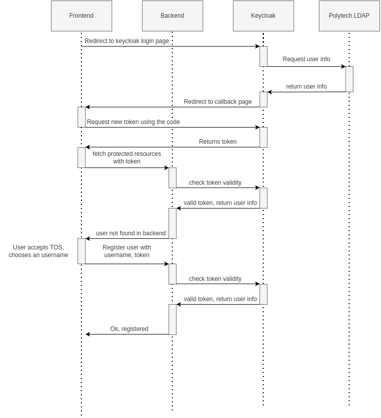
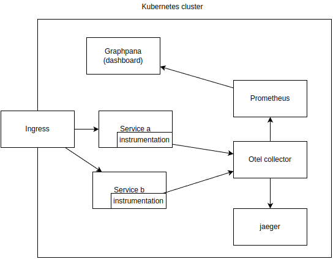
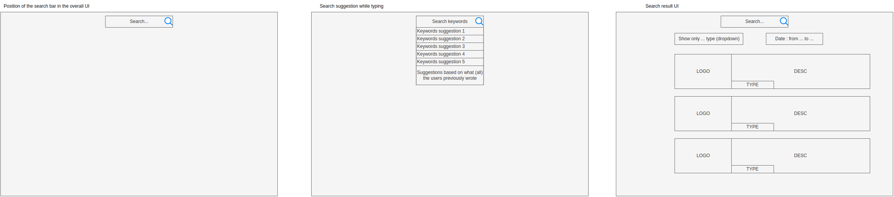

=  Polycode
Nils Ponsard <nils.ponsard@etu.umontpellier.fr>
19-10-2022
:reproducible:
:toc:

== 1 Functional quarter
=== Vocabulary 

* Admin : A privileged user that has CRUD access to all the data.
* User : Person that has a PolyCode account.
* Candidate : Person that participate to a test.
* Guest : Person that doesn't have a PolyCode account.
* Captain : Person that owns and manages a team.
* Assessment Creator : Person that can create assessments and manage them.
* Practice Creator : Person that can create contents, modules and manage them.
* Test : Ordered list of questions meant to evaluate a candidate.
* Campaign : Association of a group of candidate and a test.
* Question : Content that is used in a test.
* Module : A group of contents and other modules.
* Content : Coherent group of components that are organized in a tree structure.
* Component : Display element or interactive element in a content (example : code challenge, markdown information text).
* Hint : A piece of information that the user can buy to help him solve a problem (in a code challenge).
* PolyPoints : Virtual currency used to buy hints, earned by completing all submittables of contents and modules.
* Runner : Sandboxed environment that runs the code of the candidate.
* Submittable : Component that exposes a problem to solve. The user can submit a submission to solve the problem.
* Submission : User’s answer to a submittable, validated through a validator.
* Team : Group of users, teams are ranked in a leaderboard based of the total score of their members.
* Validator : Instructions to test the validity of a submission (example : for a specific input expect a specific output).
* Tag : Keyword that can be associated to a content or a module.

=== User stories

==== User management 

[cols="1,1,1"]
|===
|As a |I want to |So that

|Guest
|Create an account
|Use the features of the app

|User
|Update my emails
|Update my ways to recover my account, get important updates and notifications

|User
|Receive a welcome email after creating an account
|Know that my account has been created

|User
|Get information about my account
|Review my account information

|User
|Get info about another user 
|Know the user

|User
|Update my username, programming languages and short description
|Keep my information up to date

|User
|Delete my account
|Remove my data from the app

|Admin
|Promote a user to Content Creator
|Give the right to create content to a user

|Admin
|Promote a user to Assessment Creator
|Give the right to create test to a user

|Admin
|Promote a user to Admin
|Give the right to manage the app to a user

|Admin
|Create a new user
|Add a user to the app

|Admin
|Get all the information about a user
|Facilitate moderation

|Admin
|Update the information of a user
|Facilitate moderation

|Admin
|Delete a user
|Facilitate moderation

|===

==== Authorization 

[cols="1,1,1"]
|===
|As a |I want to |So that

|User
|Log in to my account via email and password
|Access my account

|User
|Logout of my account
|Prevent unauthorized access to my account

|User 
|Reset my password
|Get access to my account if I forgot my password

|===

==== Teams 

[cols="1,1,1"]
|===
|As a |I want to |So that

|User
|Create a team 
|Participate to the team leaderboard an gather users

|Captain
|Invite users to my team
|Add users to my team

|Captain
|Kick users from my team
|Remove users from my team (inactive, problematic, etc.)

|Captain
|Give the captain role to another user
|Transfer the captain role to another user

|Captain
|Delete my team
|Remove my team from the app

|Captain
|Update info about my team
|Keep my team info up to date

|User
|Accept an invitation to a team
|Join a team

|User
|Leave a team
|cease to be associated to a team

|User
|Get info about a team, members, points, name, description
|Know the team

|User
|Get the leaderboard of teams
|Know the ranking of teams

|User
|Get the leaderboard of users in a team
|Know the ranking of users in a team

|Admin
|Get, create, edit, delete a team

|===

==== Content management

[cols="1,1,1"]
|===
|As a |I want to |So that

|User 
|Get the list of available content
|Know the content available

|User
|Get the list of available modules
|Know the modules available

|User
|Get the list of contents and submodules of a module
|Know how to complete a module

|User
|Get the latest modules and contents
|Know what have been added recently

|User
|Get the information about a content
|Know the content

|User
|Get the information about a module
|Know the module, the objectives 

|User
|Get the information about a test
|Know the test, its objectives

|User
|Get the components of a content
|Get the information the content aims to convey, it’s submittables

|Content Creator
|Create a content, (markdown, code challenge components)
|Teach a notion

|Content Creator
|Create a module
|Organize the contents 

|Content Creator
|Add contents to a module
|Organize the contents

|Content Creator
|Add submodules to a module
|Organize the modules hierarchy

|Content Creator
|Edit the name, description, tags, rewards, inner components of a content I created
|Keep my content up to date

|Content Creator
|Edit the name, description, tags, rewards, inner contents and submodules of a module I created
|Keep my module up to date

|Content Creator
|Delete a content I created
|Remove my content from the app

|Content Creator
|Delete a module I created
|Remove my module from the app

|Admin
|Get, create, edit, delete a content
|Content moderation

|Admin
|Get, create, edit, delete a module
|Content moderation

|===

==== Submissions

[cols="1,1,1"]
|===
|As a |I want to |So that

|User
|Submit a solution to a submittable component
|Validate my solution

|User
|Execute a validator on my code
|Validate my solution on a public validator

|User
|Get the last solution I submitted to a submittable component
|Get back to my solution and improve it

|User
|Write a solution to a submittable component in a code editor (for a code challenge)
|Write my solution and test it

|User
|Add new sources files to a code editor (for a code challenge)
|Split the code answer in multiple files

|User
|Delete a source file from a code editor (for a code challenge)
|Organize the code answer in multiple files

|User
|Buy a hint for a submittable component
|Get a piece of information to help me solve the problem

|User
|Get my progress on a module
|Know how much I have completed a module

|User
|Get the global user leaderboard
|Gammification 

|===

==== Test management

[cols="1,1,1"]
|===
|As a |I want to |So that

|Assessment Creator 
|Create a test
|Evaluate a candidate

|Assessment Creator
|Edit the name, description, tags, rewards, inner contents of a test I created
|Keep my test up to date

|Assessment Creator
|Delete a test I created
|Remove my test from the app

|Admin
|Get, create, edit, delete a test
|Content moderation

|Assessment Creator
|Create a test campaign
|Evaluate candidates

|Assessment Creator
|Add candidates to a test campaign via the web interface
|Evaluate candidates

|Assessment Creator
|Get the list of candidates in a test campaign
|Evaluate candidates

|Assessment Creator
|Remove candidates from a test campaign
|Evaluate candidates

|Assessment Creator
|Add candidates to a test campaign via a CSV file
|Evaluate candidates

|Assessment Creator
|Add candidates to a test campaign via an api access
|Automate candidate addition

|Assessment Creator
|Remove candidates from a test campaign via an api access
|Automate candidates deletion

|Assessment Creator
|Review the submissions and scores of candidates on a test
|Evaluate the candidates

|Assessment Creator
|Add tags to a candidate
|Organize the candidates

|Assessment Creator
|Set a completion deadline for a test campaign
|Limit the time a candidate has to complete the test

|Assessment Creator
|Define a time limit for each questions in a test
|Limit the time a candidate has to answer a question

|Assessment Creator
|Define the number of points granted for each question in a test
|Giving weight to each question

|Candidate 
|Get back to a test I started and continue it if the time limit is not reached
|Complete the test

|Candidate
|Receive a mail with links to accept or refuse a test 
|Accept or refuse a test

|Candidate
|Participate to a test using the link provided in the mail
|Complete the test

|Assessment Creator
|Edit the test, the questions, the time limit and the points granted for each question
|Keep the test up to date

|Assessment Creator
|Set a start date for a test campaign
|Schedule the test

|Assessment Creator
|Resend the invitation to a candidate
|Make sure the candidate received the invitation

|Candidate
|Receive a mail with the results of a test
|Know the results of a test

|Assessment Creator
|Compare the candidates results
| 

|Assessment Creator
|Visualize the candidates results on a graph or a table
|Get a graphical representation of the results

|Assessment Creator
|Export the results of a test campaign
|

|Assessment Creator
|Order the candidates by their results and tags
|Organize the candidates

|Assessment Creator
|Download the raw data of the candidates results
|Be able to do statistical analysis on the results

|===

Architecture : `sketches/Q1-microservice/architecture.drawio`

== 2 Identification and OIDC

The user interacts with the frontend and Keycloak (accessible via the ingress)

see deployment : `sketches/Q2-identification/deployment.drawio`

architecture : `sketches/Q2-identification/architecture.drawio`

=== Deployment
image::sketches/Q2-identification/deployment.png[]

=== Architecture

=== ideas

- Redirect from frontend
- callback to frontend
- frontend sends token to backend
- backend checks token with OIDC provider `https://${keycloakHost}:${keycloakPort}/auth/realms/${realmName}/protocol/openid-connect/userinfo`

- enable Keycloak registration
- find user by email
- create user if it doesn’t exist

If email is not found, check email verification, if verified create a new user, ask for confirmation of the username, accept the TOS.

=== sequence diagrams 

`sketches/Q2-identification/google-login.drawio`

image::sketches/Q2-identification/google-login.png[]

`sketches/Q2-identification/google-register.drawio`

image::sketches/Q2-identification/google-register.png[]

`sketches/Q2-identification/ldap-login.drawio`

image::sketches/Q2-identification/ldap-login.png[]

`sketches/Q2-identification/ldap-register.drawio`

`sketches/Q2-identification/vanilla-login.drawio`

image::sketches/Q2-identification/vanilla-login.png[]

`sketches/Q2-identification/vanilla-register.drawio`

=== POC

`git@github.com:nponsard/polycode-frontend-keycloak.git`

`git@github.com:nponsard/polycode-backend-keycloak.git`

Accessible here : https://polycode-key.juno.nponsard.net[https://polycode-key.juno.nponsard.net]

== 3 Microservice communication

Some microservices depends on other microservices to get data, to do so they need a way to communicate with each other. This include having a protocol and a way to access the other services.

=== Environment variables

To point to the other services, we can use environment variables. Each services will require the address of the other services it depends on.

This can easily be set to point to a dns name, a load balancer or a service name in kubernetes, enabling high availability and load balancing.

This can become tedious to setup, these variables could have a default value corresponding to the usual service name in kubernetes.

=== Protocol 

The TRPC protocol can be used, it enables remote procedure call via HTTP so it can even be routed through layer 7 proxies/load balancers.

With TRPC the api is defined on the server via typescript types and the client uses the same types to get linting and type checking when calling the api. This makes the communication between the services very easy to write and maintain.

There is a few drawbacks, the client and the server needs to have access to the typescript type definitions, this can be mitigated by using one repository to store the sources of all the services. The other drawback is that TRPC is made to work only with typescript projects so it would rule out the possibility of using other languages for some services.

=== POC

`git@github.com:nponsard/poc-microservice-trpc.git`

== 4 Traceability and logging

=== OpenTelemetry

OpenTelemetry has instrumentations that export logs and statistics to a collector. The collector can then export data to be visualized in a dashboard like prometheus/grafana.

We need to add the instrumentation to the services code and deploy a collector, set the instrumentations to export to the collector and then set the dashboard to get data from the collector.

deployment : `sketches/Q4-tracing/deployment.drawio`

== 5 Search engine

=== Concept

See `./sketches/Q5-search/ui.drawio`.

This concept needs a new collection storing the search history of all users, containing the search query and the number of times it has been searched. The index will be on the query field (to search text).

When a user starts to type in the search field, the server will respond with suggestion of queries, matched by the beginning of the text, ordered by the number of times researched.

Selecting a suggestion fills the search field and validates the search.

Once the search is validated, use a fuzzy finding algorithm to search through the content 
TODO : strategy, explain fuzzy finding, find how to in mongo

All types of content (module, content, assignment) will be in a list of results, with the same presentation and the type marked.

Ordering with points :
* 1 point for each matching word in the description
* 2 point for each matching word in the title
* 3 point for each matching word in the tags

Results ordered by points, then by date of creation (default, can be changed to date then points).

=== Implementation

We can create an index with this command on the mongo shell :

[source,JavaScript]
----
db.blog.createIndex(
   {
     description: "text",
     tags: "text",
     title: "text"
   },
   {
     weights: {
      description: 10,
      title: 20,
      tags: 30
     },
     name: "TextIndex"
   }
 )
----

To search for a text we can use this command :

[source,JavaScript]
----
db.stores.find(
   { $text: { $search: "rust in 30 days" } },
   { score: { $meta: "textScore" } }
).sort( { score: { $meta: "textScore" } } )
----

== 6 Runner architecture

=== Runner definition

A runner is a service used to run code sent by the user in a sandboxed environment. It feeds data to the stdin of the programs and returns the stdout and stderr.

Validity of the solution can be checked by sending specific inputs to stdin and checking if the output corresponds to the expected output.

=== Execution isolation 

To negate the effect of malicious code, the user submitted code should not have arbitrary file system and memory access, internet access, host system access. The running program should also be limited in CPU and memory usage to prevent denial of service attacks.

=== Virtual machine architecture 

- minimal image ready to run the code of a specific language
- code mounted as a read only disk in the VM
- copy into ramfs 
- build 
- run
- send to stdin an get stdout an stderr via serial

TODO

LXC ?

=== Runner registration 

- Generate a token from the service managing the runners
- Launch the runner program on a machine providing the token and the address of the runner manager
- Periodically the runner will send a request to the runner manager to retrieve new jobs to run
- The runner manager send some jobs to the runner, the number of jobs depending on the capacity of the runner (CPU, RAM) and the number of runners available to the manager
- The runner runs the jobs 
- When a job finishes the runner does a request to the manager to send the result of the job

== 7 Data architecture

=== current data 

- postgresql 
- mongodb

see `./sketches/Q7-data/current.drawio`

image::sketches/Q7-data/current.png[]

== 8 Mobile app

=== Functionalities

- Read courses
- Download courses/videos for offline use 
  - check markdown embeds to download images
- Answer to MCQ questions, no code challenge
- browse courses/exercises
- manage account
- notification on new content in a module ?
- no advanced team view/ edition

see `./sketches/Q8-mobile/pages.drawio`

=== Authentication 

-> Device Authorization Grant ?
-> open web browser and redirect to open the app ?

== 9 Microservice security

- HTTPS + certificate exchange (kube secrets).

== 10 UI microservice

web components ? 

Iframe ?
-> explorer Remix et Next.js 13
